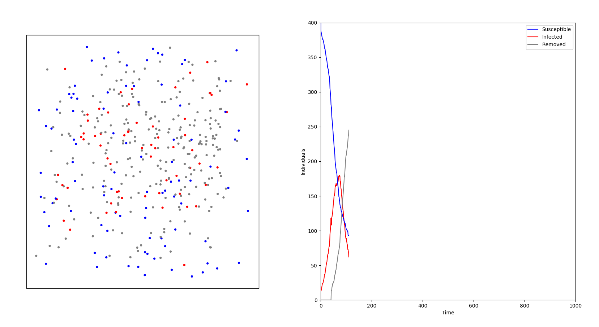

# SIRModelAnimation
SIR Model Animation written as ```matplotlib.animation.FuncAnimation```.

### Initial Idea by
- [https://www.hackster.io/pepis/animated-sir-model-for-coronavirus-spread-72c700](https://www.hackster.io/pepis/animated-sir-model-for-coronavirus-spread-72c700)
- [https://www.youtube.com/watch?v=gxAaO2rsdIs&t=1s](https://www.youtube.com/watch?v=gxAaO2rsdIs&t=1s)

### Script Execution
Run script with default parameters by simply:
```sh
$ python run.py
```

### Command Line Arguments
Command Line Arguments:
```
--n_individuals          number of individuals; default is 400
-n                       number of individuals; default is 400
###################################################################################
--prct_infected          Staring percentage of infected individuals; default is 2
-p                       Staring percentage of infected individuals; default is 2
###################################################################################
--infection_radius       Radius of virus transmission in pixels; default is 2.5
-r                       Radius of virus transmission in pixels; default is 2.5
###################################################################################
--infection_prob         Probability of virus infection of an individum; default is 6
-i                       Probability of virus infection of an individum; default is 6
###################################################################################
--prct_quarantine        Percentage of individuals in quarantine; default is 0
-q                       Percentage of individuals in quarantine; default is 0
###################################################################################
--time_infected          Time until an infected individum is removed; default is 40
-t                       Time until an infected individum is removed; default is 40
###################################################################################
```

### Example


